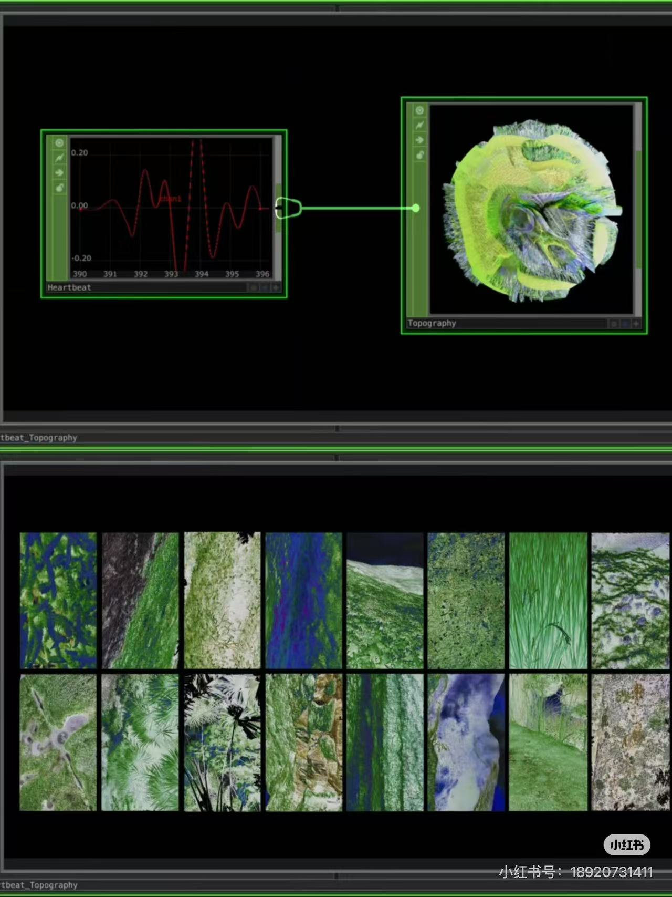
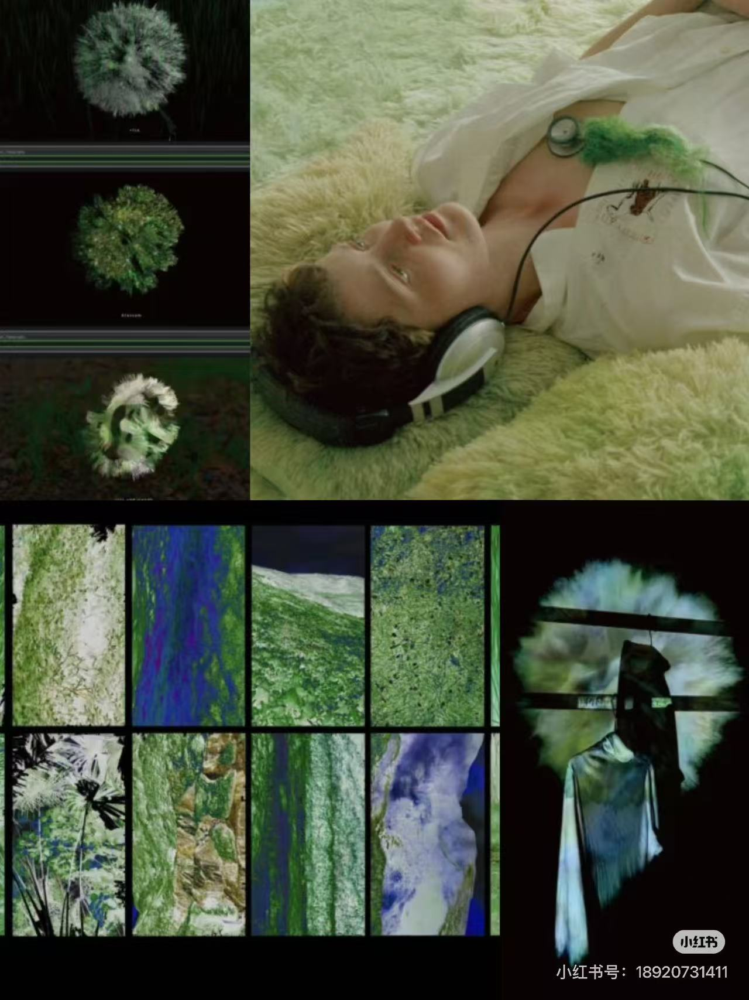
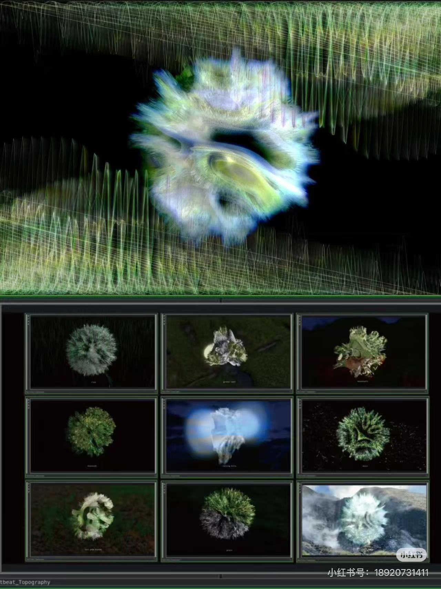

# Som---Team-2

# Project Title  
**Emotional Data Ecosystem**

---

# 1. Project Direction

## Project Type  
This project reinterprets an existing artwork, based on  
**Yu-Chieh Lin – *Heartbeat Topography***

## Original Artwork  

Yu-Chieh Lin’s work captures real-time heartbeat data and transforms it into dynamic visual landscapes. By synchronizing physiological rhythms with external sensory stimuli, the project creates an immersive environment that connects body, emotion, and digital systems.

---

## Creative Vision 

Our project expands on *Heartbeat Topography* by shifting the focus from physiological signals to emotional states. Inspired by Yu-Chieh Lin’s translation of heartbeat into visual landscapes, and influenced by organic AI-generated aesthetics such as Memo Akten’s *Deep Meditations*, we aim to construct a dynamic “emotional ecosystem.”

In this system, emotion is visualized as a living, evolving digital entity. Through audio input, time progression, Perlin noise, and user interaction, the system continuously grows, mutates, and decays. The project explores how internal emotional states can be externalized and experienced as a shared, immersive environment, reflecting the relationship between human perception, data, and nature.

---

## References / Inspirations  





- Yu-Chieh Lin – *Heartbeat Topography*  

---

# 2. Mechanisms

## Team Members & Responsibilities  

| Member     | Mechanism                 | Responsibility                        |
| ---------- | ------------------------- | ------------------------------------- |
| Ying Hu    | Audio-driven system       | Capture and analyze sound data        |
| Jade Gu    | Time-based system         | Control lifecycle and transitions     |
| Yidan Wang | Perlin noise & randomness | Generate organic motion and forms     |
| Hantao Xu  | User interaction          | Design interaction and control system |

---

## 1. Audio-driven Mechanism (Ying Hu)

The audio-driven system serves as the primary energy source of the Emotional Data Ecosystem. Instead of capturing real physiological heartbeat data, the project uses curated heartbeat recordings and emotional soundscapes to simulate different emotional states.

A shared emotion slider controls three emotional zones—Unpleasant, Neutral, and Pleasant. Each emotional state contains two synchronized audio layers: Heartbeat audio (main emotional signal) and Ambient background audio (emotional atmosphere).

The system continuously crossfades between these layers as the emotional value changes, creating smooth transitions rather than abrupt emotional shifts. The heartbeat remains the dominant signal, while the background sound enriches the emotional environment without overpowering the visual response.

The emotional slider ranges from -1 to 1 and blends between three emotional sound states. The transition between emotional states uses a smooth interpolation curve, allowing emotional changes to feel continuous and organic rather than mechanical. This crossfade mechanism reflects the idea that emotions rarely exist as fixed categories and instead move fluidly along a spectrum.

To transform sound into visual behaviour, the system performs real-time audio analysis using both Amplitude analysis and FFT spectrum analysis. The heartbeat signal is analyzed continuously to generate an activity value that can be shared with the visual system. Low-frequency energy, especially bass frequencies associated with heartbeat rhythms, is given the strongest influence. This process transforms audio into a dynamic emotional force that drives the behaviour of the ecosystem.

User interaction directly influences the emotional system. The first click activates the audio environment and begins playback. Afterwards, clicking near the central sphere triggers an additional heartbeat pulse. These interactions temporarily increase the system’s activity level, causing stronger visual reactions and reinforcing the idea that emotions can be externally stimulated and amplified through interaction.


---

## 2. Time-based Mechanism (Jade Gu)

The time-based system controls the lifecycle of the visual ecosystem through a continuous timeline. The system evolves through phases: generation, growth, mutation, and decay.

As time progresses, structured forms gradually become more complex and unstable, eventually dissolving or reorganizing. Even without user interaction, the system remains active, emphasizing autonomy and temporal transformation.

This mechanism introduces a narrative dimension, simulating emotional cycles such as buildup, release, and dissipation. It reflects the concept of emotional temporality and aligns with the idea of a “living” data organism.

---

## 3. Perlin Noise & Randomness (Yidan Wang)
### AI Usage Statement

Some parts of this mechanism were developed with the assistance of AI tools. AI was used to help refine the structure of the Perlin noise system, suggest clearer code comments, and improve the written explanation for the README. The final creative direction, visual decisions, code selection, testing, and integration were reviewed and adjusted by the team member.

### Mechanism Overview

This mechanism uses **Perlin noise and seeded randomness** to make the emotional ecosystem feel organic, unstable, and alive. It controls the sphere’s surface deformation, colour changes, and the surrounding atmospheric particles.

| Visual Element       | Technique                | Role in the Project                             |
| -------------------- | ------------------------ | ----------------------------------------------- |
| Main sphere surface  | 3D Perlin noise          | Creates organic emotional deformation           |
| Surface colour       | Perlin colour sampling   | Produces smooth colour transitions              |
| Background particles | Seeded randomness        | Builds a unique atmosphere each run             |
| Star-like flicker    | Perlin brightness change | Shows emotional energy in the surrounding space |
| Emotion slider       | Shared `emotionValue`    | Connects this system to the group interaction   |

---

### Surface Deformation

The main sphere samples Perlin noise across its 3D surface:

```js
getDeformation(xDir, yDir, zDir)
```

This creates smooth deformation instead of sudden random movement. The shared emotion slider changes the form:

| Emotion State | Visual Behaviour            |
| ------------- | --------------------------- |
| Unpleasant    | Sharper and more unstable   |
| Neutral       | Calmer and more balanced    |
| Pleasant      | Smoother and more expansive |

---

### Perlin Colour System

The sphere colour is also generated through Perlin noise:

```js
getSurfaceColor(xDir, yDir, zDir, layer, alpha)
```

Each point on the sphere samples a slightly different noise value, so the colour shifts gradually across the surface instead of changing as one flat colour.

<div>
  <span style="display:inline-block;width:90px;height:18px;background:#39d9ff;"></span>
  <span style="display:inline-block;width:90px;height:18px;background:#55ff9a;"></span>
  <span style="display:inline-block;width:90px;height:18px;background:#f4d35e;"></span>
  <span style="display:inline-block;width:90px;height:18px;background:#ff4fa3;"></span>
</div>

The colour system supports the emotional direction of the project:

| Emotion Direction | Colour Feeling                                    |
| ----------------- | ------------------------------------------------- |
| Unpleasant        | More uneasy magenta and acidic tones              |
| Neutral           | Soft green tones connected to the original sphere |
| Pleasant          | Calmer cyan, green, and warm highlights           |

---

### Seeded Randomness

A new seed is created each time the sketch runs:

```js
this.seed = floor(random(100000));
randomSeed(this.seed);
noiseSeed(this.seed);
```

This gives each experience a slightly different visual personality while keeping the motion coherent. The background particles use seeded values for their position, size, distance, and noise offset.

---

### Atmospheric Star Particles

The surrounding particles extend the emotional field beyond the main sphere. They use the same Perlin colour system, so the sphere and background feel connected.

```js
let sparkleAmount = abs(this.emotionValue);
let twinkleNoise = noise(t * 8.0 + 120);
let twinkle = pow(twinkleNoise, 3);
```

When the emotion slider is close to neutral, the particles stay subtle. When the slider moves away from neutral, they begin to twinkle like small stars.

| Emotion Intensity | Particle Behaviour         |
| ----------------- | -------------------------- |
| Neutral           | Dim and calm               |
| Medium            | Gentle flickering          |
| Strong            | Brighter star-like twinkle |

---

## 4. User Interaction Mechanism (Hantao Xu)

The user interaction mechanism moves beyond basic point-to-point tracking by implementing a memory-based trajectory system. Using mouse input, the program continuously records the movement history of the user over a rolling ten-second window. The central digital ecosystem responds to the overall shape and intensity of this recent history rather than just the current cursor position. 

Smooth and continuous gestures will calm the generative environment and produce soft visual pulsations. On the other hand, erratic and sharp movements leave lasting disruptions in the data space, causing the surrounding Perlin noise terrain to become chaotic and unstable.

 This approach serves as a metaphor for how our present emotional states are constantly shaped by the lingering effects of our immediate past.It positions the user as an active catalyst whose behavioral history directly molds the stability and flow of the digital topography.

---

# 3. Integration 

All mechanisms are integrated within a shared visual canvas to form a cohesive emotional ecosystem. Audio input provides energy, time defines the lifecycle, Perlin noise generates organic motion, and user interaction disrupts and reshapes the system.

Together, they create a dynamic balance between order and chaos. The project is unified both visually and conceptually as a “living emotional landscape,” where data, perception, and interaction continuously influence one another.

---
